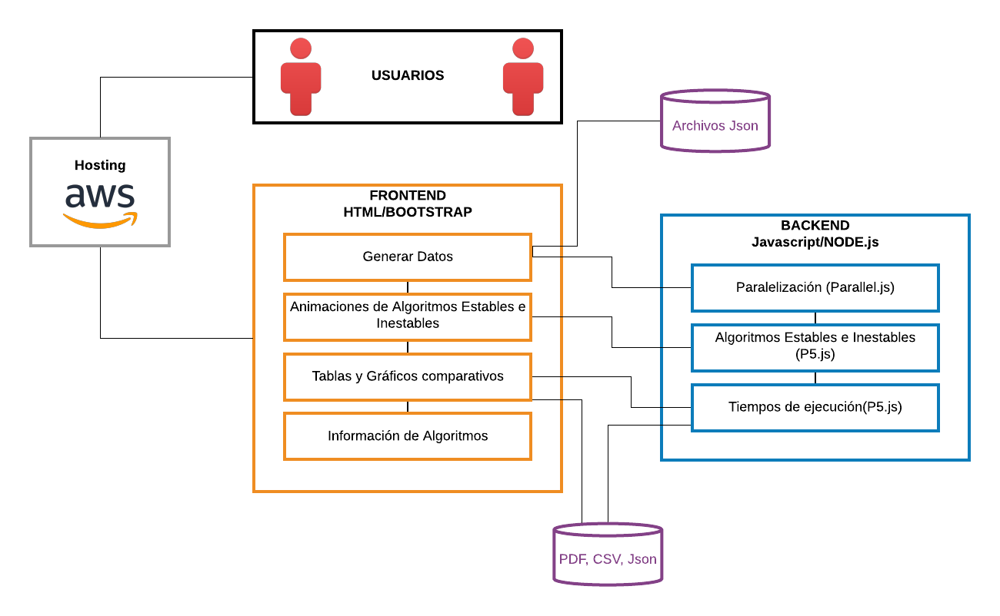

# *PF1. Algoritmos de Búsqueda y Ordenamiento*
---
#### Materia: *Análisis y Diseño de Algoritmos*

##### Integrantes:
1. *LUIS DANIEL ROA GONZÁLEZ* - *A01021960* - *Campus Santa Fe*
2. *KATIA YARETH BELLIDO LÓPEZ* - *A01023638* - *Campus Santa Fe*
3. *CONSTANZA GÓMEZ SÁNCHEZ* - *A01026717* - *Campus Santa Fe*
4. *CHRISTOPHER LUIS MIRANDA VANEGAS* - *A01022676* - *Campus Santa Fe*
5. *MIGUEL MONTERRUBIO BANDERA* - *A01022153* - *Campus Santa Fe*

---
## 1. Aspectos generales

Las orientaciones de la tarea se encuentran disponibles en la plataforma **Canvas**.

Este documento es una guía sobre qué información debe entregar como parte del proyecto, qué requerimientos técnicos debe cumplir y la estructura que debe seguir para organizar su entrega.

### 1.1 Requerimientos técnicos

A continuación se mencionan los requerimientos técnicos mínimos del proyecto, favor de tenerlos presente para que cumpla con todos.

* El equipo tiene la libertad de elegir las tecnologías de desarrollo a utilizar en el proyecto, sin embargo, debe tener presente que la solución final se deberá ejecutar en una de las siguientes plataformas en la nube: [Google Cloud Platform](https://cloud.google.com/?hl=es), [Amazon Web Services](https://aws.amazon.com/) o [Microsoft Azure](https://azure.microsoft.com/es-mx/).
* El proyecto deberá utilizar una interfaz Web.
* La arquitectura deberá estar separada claramente por capas (*frontend*, *backend*, *API RESTful*, datos y almacenamiento) según se necesite.
* Todo el código, *datasets* y la documentación del proyecto debe alojarse en este repositorio de GitHub. Favor de mantener la estructura de carpetas propuesta.

### 1.2 Estructura del repositorio

El proyecto debe seguir la siguiente estructura de carpetas, la cual generamos por usted:
```
- / 			        # Raíz de todo el proyecto
    - README.md			# Archivo con los datos del proyecto (este archivo)
    - frontend			# Carpeta con la solución del frontend (Web app)
    - backend			  # Carpeta con la solución del backend (CMS)
    - api			      # Carpeta con la solución de la API
    - datasets		  # Carpeta con los datasets y recursos utilizados (csv, json, audio, videos, entre otros)
    - dbs			      # Carpeta con los modelos, catálogos y scripts necesarios para generar las bases de datos
    - docs			    # Carpeta con la documentación del proyecto
```

### 1.3 Documentación  del proyecto

Como parte de la entrega final del proyecto, se debe incluir la siguiente información:

* Descripción del problema a resolver.
* Diagrama con la arquitectura de la solución.
* Descripción de cada uno de los componentes de la solución.
* Guía de configuración, instalación y despliegue de la solución en la plataforma en la nube seleccionada.
* Documentación de la API. Puede ver un ejemplo en [Swagger](https://swagger.io/). 
* El código debe estar documentado siguiendo los estándares definidos para el lenguaje de programación seleccionado.

## 2. Descripción del proyecto

Como proyecto final para la materia de *Análisis y diseño de algoritmos*, se nos solicitó hacer una aplicación web en la cual un usuario pueda ver como funcionan diferentes algoritmos y las características de ambos, tanto de ordenamiento como de búsqueda.

Los algoritmos que se presentarán en las búsquedas son 2:

•Secuencial .

•Binaria.

Y los algoritmos de ordenamiento se dividirán en estables e inestables : 

•Ordenamiento de burbuja(Bubble Sort) .

•Ordenamiento de burbuja bidireccional (Cocktail Sort) .

•Ordenamiento por inserción (Insertion Sort) .

•Ordenamiento por casilleros (Bucket Sort) .

•Ordenamiento por cuentas (Counting Sort) .

•Ordenamiento por mezcla (Merge Sort) .

•Ordenamiento con árbol binario (Binary tree Sort) .

•Ordenamiento Radix (Radix Sort) .

•Ordenamiento Shell (Shell Sort) .

•Ordenamiento por selección (Selection Sort) .

•Ordenamiento por montículos (Heap Sort) .

•Ordenamiento rápido (Quick Sort)  .

Este proyecto cuenta con dos carpetas principales, un _frontend_ y un _backend_. Cada uno de estos aloja los documentos necesarios para poder correr la solución.

Al establecer conexión entre estas dos carpetas, se está mandando a llamar desde el backend, pero esto será explicado en su sección específica.

- **NOTA**
    - **No sé si haga falta algo de la descripción que quieran completar**
    - **La página aun no se encuentra desplegada, pero será actualizado cuando se haya desplegado.**

## 3. Solución

A continuación aparecen descritos los diferentes elementos que forman parte de la solución del proyecto.

### 3.1 Arquitectura de la solución



El usuario podrá conectarse con nuestra aplicación web por medio de un link de AMAZON WEB SERVICES. En está aplicación lo que podrá observar serán las diferentes características de cada tipo de algoritmo de ordenamiento y busqueda. Así pues existirán diferentes pantallas que le permitirán generar datos aleatorios o ingresarlos por medio de un Json, para que después se puedan analizar dos tipos de algoritmos de forma ascendente o descendente por medio de paralelización(backend) y a su vez se pueda acceder a una nueva pantalla con la visualización del funcionamiento de dichos algoritmos a analizar. También se permitirá la creación de gráficas con los resultados de los tiempos de ejecución de cada algoritmo que se podrán descargar en PDF, CSV, Json. Todo esto será posible visualizarlo por HTML y BOOTSTRAP en la parte de FRONTEND y NODE.js, y JAVASCRIPT con las librerias de 'P5js', 'Parallel.js' en la parte de BACKEND.

### 3.2 Descripción de los componentes


#### 3.2.1 Hosting

El proyecto está siendo desplegado en un servicio llamado _Amazon EC2_, este actúa como una computadora con servicio en la nube. Para que los usuarios puedan tener acceso a la página, se habilitaron diferentes puertos (80, 423, 3000 y 4000) para ver cuál permitía una conexión a la página. Esto conllevo a que desplegara en el puerto _3000_ de este mismo, pero esto fue debido al acceso que proporciona la instancia.
Para acceder a la página, puede ingresar al siguiente link:

>http://18.191.33.21:3000/

#### 3.2.2 Backend

El backend se encuentra programado completamente en JavaScript, esto se debe a que estamos utilizando librerías necesarias para desplegar las páginas requeridas y recibir/enviar los datos insertados a otras páginas.

Las librerías y su implementación serán explicados en la sección _3.4_.

#### 3.2.3 Frontend

La solución del frontend está programada completamente en HTML, esto permitió que tuvieramos flexibilidad al momento de programar la interfaz del usuario.

La comunicación entre el frontend y el backend será explicada posteriormente.

#### 3.2.4 Archivos 

Los archivos que el usuario podrá ingresar serán tipo Json, además que se podrán exportar los elementos en formato PDF, CSV y Json.

### 3.3 Frontend


El frontend fue programado completamente en HTML y se implementa el uso de CSS mediante Bootstrap.
Este puede ser encontrado [aquí](https://getbootstrap.com/docs/4.5/getting-started/introduction/), y fue implementado de la siguiente manera:

```
<link rel="stylesheet" href="https://stackpath.bootstrapcdn.com/bootstrap/4.5.0/css/bootstrap.min.css" integrity="sha384-9aIt2nRpC12Uk9gS9baDl411NQApFmC26EwAOH8WgZl5MYYxFfc+NcPb1dKGj7Sk" crossorigin="anonymous">
```

Esto permite que los HTMLs contengan un formato adecuado para el manejo de datos y poder mantener orden dentro de la aplicación web.

La manera en la que se despliega es mediante solicitudes _app.get()_ que se están llevando a cabo en el backend, especificamente en el documento llamado _[index.js](/backend/index.js)_.

Al inicializar el frontend desde el script index.js, se están mandando a llamar datos por los cuales el usuario está realizando operaciones de tipo _post_.

La aplicación funciona utilizando operaciones del tipo **RESTful**, es decir con el uso de acciones de tipo *POST* y del tipo *GET*.
Las operaciones post fueron utilizadas para mandar a llamar datos que se están insertando en el HTML.

Por ejemplo, para que el usuario pueda insertar tanto los nombres de los algoritmos, como el valor numérico que se usará para generar los valores aleatorios, está utilizando una operación de tipo _post_. 
Estos datos están siendo leídos en el backend, especificamente en las secciónes que comienzan con el enunciado `app.post()`. Eso permite que, dependiendo de la acción programada en el HTML, se envíen a ese campo.

Para las operaciones de tipo _get_, se está haciendo algo distinto. Esta operación se está encargando del despliegue/visualización de los documentos HTML. En otras palabras, cuando se manda a llamar a otra página, como regresar al inicio de la aplicación web, esta tomando lugar en una operación de este tipo.
Para poder identificar estas secciones, se están mandando a llamar con el enunciado `app.get()`, esto permite cargar el documento especificado. Es importante recalcar, esos documentos se encuentran en la carpeta del _frontend_.

Para que el web app pueda aceptar archivos JSON y usar los datos de éstos para la ejecución de los algoritmos, se usó un pequeño _workaround_, en donde el manejo del JSON es hecho completamente en el frontend, el cual abre el archivo y manda el contenido a el backend mediante un _post_, en donde se "procesa" para pasar los números a un arreglo que puede ser usado más fácilmente por los algoritmos de búsqueda y ordenamiento.

#### 3.3.1 Lenguaje de programación

El frontend fue programado completamente utilizando archivos HTML, con integración de scripts de JavaScript dentro de varios de estos mismo.

Como se mencionó anteriormente, se implementó CSS (Cascade Style Sheet) mediante Bootstrap.
Esto nos permite tener acceso completo a una librería para poder modelar la aplicación como nos guste.

#### 3.3.2 Framework

Para el frontend no se manejó ningún framework existente.

#### 3.3.3 Librerías de funciones o dependencias

Para poder realizar operaciones del tipo _RESTful_, se está utilizando la librería **body-parser** de npm.

Esto nos permite realizar operaciones de tipo *POST* y *GET*.

El usuario puede insertar los valores numéricos y los nombres de los algoritmos que desea correr mediante el uso de una operación *POST*.

En cambio, las operaciones de tipo *GET* se encargan de cargar y desplegar las páginas que componen el proyecto.

### 3.4 Backend

El backend del proyecto es hecho con JavaScript. Esto nos permitió implementar las librerías necesarias para poder correr la aplicación como es requerido. Así generando datos aleatorios u obteniendolos de archivos Json. Una vez generados los datos se eligen dos algoritmos a comparar de la misma clase, búsqueda con búsqueda, inestables con inestables o finalmente estables con estables. Además de la comparación se realizarán las visualizaciones de los 14 algoritmos especificados, al principio de este proyecto,  cabe especificar que no podrán verse al mismo tiempo si no por decisión del usuario, se podrán también exportar gráficas de los datos que se generaron y los tiempos de ejecución de los algoritmos debido al almacenamiento de los mismos. 

Todo esto esta conectado con Frontend mediante operaciones de tipo _RESTful_, esto permite que se desplieguen las páginas necesarias mediante operaciones del tipo _GET_. En cambio, las operaciones de tipo _POST_ se están encargando.

El frontend y el backend establecen una conexión mediante operaciones de tipo _RESTful_, esto permite que se desplieguen las páginas necesarias mediante operaciones del tipo _GET_. En cambio, las operaciones de tipo _POST_ están manejando los datos que están siendo ingresados en los <form>

Para paralelizar los códigos utilizamos c y c++, sin embargo existen diferentes algoritmos que decidimos dejar de paralelizar pues sería pérdida de espacio y tiempo en el código.

#### 3.4.1 Lenguaje de programación

Javascript es un lenguaje de programación que esta creado para usar solo un hilo al correr código, esto se debe a que es muy rápido por su naturaleza al ser un modelo asíncrono y no bloqueante que usa loop de eventos. Sin embargo los programadores con experiencia concuerdan que la implementación del paralelismo sería un efecto positivo en el lenguaje. Diferentes desarrolladores se han encargado de hacer librerías como “Parallel.js”  que resuelven ese problema al brindar acceso de alto nivel al procesamiento multinúcleo utilizando trabajadores web (web workers),logrando la ejecución de código en el navegador y en la consola. Así también han creado librerías para mejorar la representación visual de diferentes ejecuciones de código, una de estas librerías es conocida como P5js que se enfoca en la programación creativa, pues tiene un conjunto completo para dibujar y animar objetos dentro de las páginas web con la ayuda de javascript y html.

#### 3.4.2 Framework

El Framework utilizado se conoce como Node.js debido a que nos permitió ejecutar librerías como Parallel.js, edge-js, así como otras que se mencionarán en el siguiente punto.

#### 3.4.3 Librerías de funciones o dependencias

* Parallel.js  para la creación de datos aleatorios y la comparación de algoritmos, sin embargo esta librería contaba con ciertas restricciones, ya que los web workers, que son muy parecidos a los Child process no permiten la extracción de datos una vez se finaliza la acción esperada.
* P5js para la animación del proceso que tienen cada uno de los 14 algoritmos de búsquedas y ordenamientos, igual que la librería anterior P5js también tiene restricciones, las cuales impedían juntar dos visualizaciones al mismo tiempo.
* Aunque se haya explicado en el frontend, la utilidad principal de body-parser puede ser encontrado en el backend, esto se debe a la manera en la que se están manejando, tanto las páginas como los datos. Body-parser se encarga de poder cargar una página web al momento de navegar a través de la página web, al mismo tiempo, nos permite realizar las operaciones de tipo post para poder recibir los datos insertados en el backend.

- body-parser
- edge-js
- express
- express-edge
- fs-extra
- jsonfile
- nodemon
- paralleljs

### 3.5 API

El API para poder llevar a cabo la solución del proyecto, fue programada en JavaScript, esto se debe al manejo de las transacciones/operaciones que están ocurriendo en el fondo.

Como se mencionó anteriormente, el manejo de las operaciones esta conformado por operaciones de tipo _POST_ y _GET_. Este tipo de operaciones son los que conforman, tanto la navegación, como la inserción de datos para que el backend pueda envíar los datos y al usuario al a sección correcta.

#### 3.5.1 Lenguaje de programación

Tanto el API como el backend, fueron programados en JavaScript. 
A estos, se le integraron las librerías requeridas para que pueda funcionar de la manera debida.

#### 3.5.2 Framework

Para el backend no se utilizó ningún tipo de framework, todo fue programado por el equipo.

#### 3.5.3 Librerías de funciones o dependencias


Dentro del API se encuentran dos operaciones principales, POSTS y GETS, para facilitar la explicación de las funcionalidades, las siguientes secciones se encuentran divididas respecto sus operaciones correspondientes.

##### 3.5.3.1 POST

**app.post('/burbujaVis', ...)**
* http://18.191.33.21:3000/burbujaVis

* Esta página se encarga de mandar el valor numérico a su página especificada para que pueda correr la visualización deseada, a continuación, se pueden ver las diferentes versiones que hay para poder envíar los datos a su página respectiva:


    * _/bucketVis_
        * http://18.191.33.21:3000/bucketVis
    * _/cocktailVis_
        * http://18.191.33.21:3000/cocktailVis
    * _/countingVis_
        * http://18.191.33.21:3000/countingVis
    * _/insertVis_
        * http://18.191.33.21:3000/insertVis
    * _/mergeVis_
        * http://18.191.33.21:3000/mergeVis
    * _/radixVis_
        * http://18.191.33.21:3000/radixVis
    * _/heapVis_
        * http://18.191.33.21:3000/heapVis
    * _/quickVis_
        * http://18.191.33.21:3000/quickVis
    * _/selectionVis_
        * http://18.191.33.21:3000/selectionVis
    * _/shellVis_
        * http://18.191.33.21:3000/shellVis
    * _/binaryVis_
        * http://18.191.33.21:3000/binaryVis
    * _/sequentialVis_
        * http://18.191.33.21:3000/sequentialVis

* Todas estas operaciones funcionan con el método _POST_.

Como se puede notar, estas funciones están usando un formato similar, lo que cambia entre ellas es el URL donde realiza la operación POST.

* El error que puede llegar a aparecer es: 
>Error, site not found

**app.post('/algoritmosEstables/conf', ...)**

* Esta operación se enfoca en recibir los datos insertados por el usuario, los nombres de los algoritmos y la cantidad de valores aleatorios que se van a generar, y los inserta en dos _switches_, el primero se enfoca en checar el primer algoritmo insertado y el segundo en el segundo input hecho por el usuario.
Para generar el arreglo de manera correcta, se está insertando a una función donde se genera un arreglo aleatorio en ese momento.
* http://18.191.33.21:3000/algoritmosEstables/conf
* _POST_
* >Error, site not found

**app.post('/algoritmosInestables/conf', ...)**

* Esta operación se encarga de recibir los valores insertados y cargarlos a dos switches (anidados) para poder correr los algoritmos de tipo inestables. 
Al igual que los estables, se está insertando un valor numérico para poder generar el arreglo.
* http://18.191.33.21:3000/algoritmosInestables/conf
* _POST_
* >Error, site not found

**app.post('/algoritmosBusqueda/doc', ...)**

* En esta operación se están recibiendo los datos insertados por el usuario en la página en la que se insertó un documento a la aplicación web.
Esta operación se enfoca en realizar los algoritmos de búsqueda.
* http://18.191.33.21:3000/algoritmosBusqueda/doc
* _POST_
* >Error, site not found

* **NOTA**
    * Las operaciones son similares debido a que manejan los mismos campos, pero una vez que son insertados, se están insertando en las variables requeridas para que se pueda correr el algoritmo especificado con la cantidad de valores numéricos requeridos.

##### 3.5.3.2 GET

Las operaciones detipo GET que se encuentran presente en este API se están usando para poder cargar sus páginas correspondientes, esto permite que las páginas web solicitadas carguen su página respectiva.

El documento que se está mandando a llamar es el que se encuentra dentro de la operación **sendFile(__dirname, '/_AQUÍ_');**, es decir, esto permite que se cargue el documento desde el path correspondiente.

**app.get('/', ...)**

* En esta operación se está cargando la página de inicio de la aplicación, en la carpeta del frontend se llama _home.html_.
* http://18.191.33.21:3000/
* GET
* >Error, site not found

*[Por cada endpoint debe incluir lo siguiente:]*

* **Descripción**:
* **URL**:
* **Verbos HTTP**:
* **Headers**:
* **Formato JSON del cuerpo de la solicitud**: 
* **Formato JSON de la respuesta**:


## 3.6 Pasos a seguir para utilizar el proyecto

##### 1. Ingresar a http://18.191.33.21:3000/
##### 2. Ingresar a la categoría deseada
##### 3. Seleccionar si desea subir un json con los números deseados, o crear un arreglo desde cero
##### 4. Elegir los alrigitmos deseados
Contar en tu computadora con NODE.js, dde ser necesario instalarlo de [aquí](https://nodejs.org/es/download/).

1. Primero, se necesita clonar el repositorio, con el siguiente comando:

   ```
    git clone https://github.com/tec-csf/tc2017-pf-primavera-2020-equipo-1-2.git
    ```

    Una vez que se haya descargado el repositorio, se tendrán las siguientes carpetas de manera local:

     - Arquitectura	      
     - backend
     - dbs
     - frontend

    También el [README.md](README.md) que se encuentra en la carpeta raíz.


  3. Una vez que tenga el repositorio en su computadora, entre a la carpeta llamada _backend_ con el siguiente comando:

  `
  cd tc2017-pf-primavera-2020-equipo-1-2/backend
  `

 4. Para instalar las librerías necesarias para que el proyecto corra, es necesario correr el siguiente comando.

    `
    npm install
    `

 5. Para poder el correr el proyecto de manera local, es necesario correr el siguiente comando:
    
    `
    npm start
    `

  6. Una vez que este corriendo, se puede conectar mediante su buscador preferido ingresando a la siguiente página <localhost:4000>.

  7. Este último comando lo va a llevar a la pagina de inicio donde puede entrar con un usuario existente o crear uno nuevo.

  8. Una vez que haya ingresado con su cuenta recién hecha, podrá realizar las operaciones que se encuentran disponibles en la página web. 
  

## 4. Referencias

* https://lemoncode.net/lemoncode-blog/2018/1/29/javascript-asincrono
* https://parallel.js.org/
* https://p5js.org/es/
* https://nodejs.org/es/about/
* http://mmc.geofisica.unam.mx/acl/Herramientas/ComputoParalelo/IsParallelismForYou-ppt.pdf
* https://es.wikipedia.org/wiki/Algoritmo_de_ordenamiento
